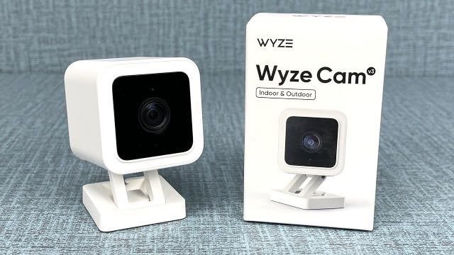
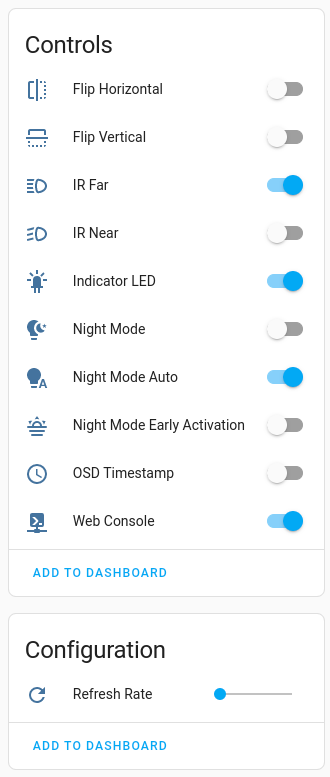
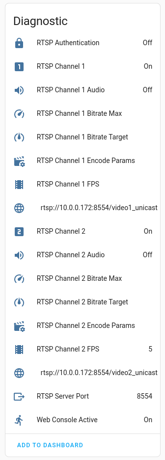

# This is a slight fork from g8keeperzuul's mqtt repo, credit to him
I just made small alterations to the install script to accept an ssh key, eg. ./install.sh CAMERA_IP OPENSSH_KEY is the usage for it

Also added taking a snapshot every 10 seconds into the mqtt-motion script that saves it as CAM_HOSTNAME.jpg in directory defined in mosquitto.conf, not super happy about how that's done but wanted the camera to serve scrypted's snapshot plugin since the regular jpeg.cgi doesn't work (I think because scrypted expects arrays for the http headers which wz_mini's cgi-bin implementation doesn't use.

I ended up enabling cifs and mounting my Home Assistant /config/www folder on the camera at boot with a mount command dropped in /opt/wz_mini/etc/rc.local.d and serve the snapshot from hass.local:8123/CAM_HOSTNAME.jpg.  Just so I'm not writing a new snapshot to the sd card every 10 seconds.

Added expire_after to the autodiscovery script only for the motion sensor right now, it uses the STATUSINTERVAL defined in mosquitto.conf.  Using that to detect when the script hangs, which doesn't happen often but does happen. Motion sensor mqtt topic normally fires status every 10-30 seconds, with expire_after if no message received after STATUSINTERVAL the binary_sensor goes unavailable in Home Assistant.

# Adding MQTT Status and Control Integration to a wz_mini_hack Installed Camera

This project adds [Home Assistant](https://home-assistant.io) integration via MQTT to Wyze Cam V3.



The [Wyze Cam V3](https://www.wyze.com/products/wyze-cam?related_selling_plan=41618559008930) is an inexpensive and [pretty capable](https://fccid.io/2AUIUWYZEC3) little IP camera. Of course Wyze would have you sign up for a monthly subscription in order to be able to fully utilitize the camera. However, with the [wz_mini_hacks project](https://github.com/gtxaspec/wz_mini_hacks), you are able to add RTSP video streaming capabilities that can be constrained to your local network. Using a free network video recorder such as [Frigate](https://frigate.video/), you can record as much video has you have storage space. While the Wyze Cam V3 has motion and basic object detection capabilities, once you have local RTSP streaming enabled, you can essentially disable those device features, and leverage the more powerful equivalents through Frigate. 

The [Xiaomi-Dafang-Hacks project](https://github.com/EliasKotlyar/Xiaomi-Dafang-Hacks) added a comprehensive set of new capabilities via a firmware replacement for the older Wyze Cam V2 (Ingenic T20) models. What was great about this project was the Home Assistant integration via MQTT it provided. Unfortunately the Dafang-Hacks isn't compatible with the new Ingenic T31 based cameras such as the Wyze Cam V3. This project aims to provide the same Home Assistant MQTT integration to the V3 using the Dafang-Hacks project as inspiration. 




## Prerequisites
1. [wz_mini_hacks project](https://github.com/gtxaspec/wz_mini_hacks) installed to a Wyze Cam V3 and completely setup so that it has wireless networking configured so you can ssh to the device.
2. Make sure you have defined CUSTOM_HOMENAME in /opt/wz_mini/wz_mini.conf (on camera)

## Steps
1. Determine the IP of the camera and verify that you can open a secure shell (ssh). Generally a good idea to ensure that this IP remains stable (either statically assigned or permanent DHCP lease)
2. Download this project and make your personal modifications to mosquitto.conf
3. Run install.sh \<camera-ip\>. This script will upload the MQTT client and custom Home Assistant integration scripts and binaries to the camera and run a camera-local setup script. The camera will automatically reboot when complete.
4. Verify you can see new MQTT messages on the broker. 
5. Verify you can see a new camera device in Home Assistant. During the boot process, the camera will send Home Assistant compatible MQTT auto-discovery messages so that the camera should appear immediately in Home Assistant (under Settings \> Devices). 

## Usage
The base topic name is: 

`(mosquitto.conf:MQTT_HA_TOPIC_BASE)/camera/(wz_mini.conf:CUSTOM_HOSTNAME)/(see below)`

For example: 

`homeassistant/camera/wyzec3_838c`

Simply, to read state (MQTT subscribe): 	

`[base topic]/some-feature/optional-sub-feature`

To write state update (MQTT publish):	    

`[base topic]/some-feature/optional-sub-feature/set`

Reading camera configuration supported features:
```
    /osd_time -> ON|OFF
    /leds/indicator -> ON|OFF
    /night_mode  -> ON|OFF
    /night_mode/auto -> ON|OFF
    /night_mode/early_activation -> ON|OFF
    /leds/ir_near -> ON|OFF
    /leds/ir_far -> ON|OFF
    /flip_vert -> ON|OFF
    /flip_horz -> ON|OFF
    /refresh_rate -> [integer]
    /rtsp_server/port -> [integer]
    /rtsp_server/authentication -> ON|OFF
    /rtsp_server/channel1 -> ON|OFF
    /rtsp_server/channel1/audio -> ON|OFF
    /rtsp_server/channel1/fps -> [integer]
    /rtsp_server/channel1/url -> [url]
    /rtsp_server/channel2 -> ON|OFF
    /rtsp_server/channel2/audio -> ON|OFF
    /rtsp_server/channel2/fps -> [integer]
    /rtsp_server/channel2/url -> [url]
    /rtsp_server/channel1/bitrate_max -> [integer]
    /rtsp_server/channel2/bitrate_max -> [integer]
    /rtsp_server/channel1/bitrate_target -> [integer]
    /rtsp_server/channel2/bitrate_target -> [integer]
    /rtsp_server/channel1/enc_params -> [string]
    /rtsp_server/channel2/enc_params -> [string]
    /web_console -> ON|OFF
    /web_console/available -> ON|OFF  (if httpd is running)

    /status --> [JSON string]
            {
            "last_boot": "2022-11-10 21:10:43",
            "ts": "2022-11-12T02:00:45+00:00",
            "ip": "10.0.0.172",
            "link_quality": 79,
            "signal_level": 60,
            "noise_level": 0,
            "bit_rate": "72.2 Mb/s",
            "device": {
                "name": "wyzec3_838c",
                "identifiers": "D0:3F:27:5D:83:8C",
                "mf": "Wyze",
                "mdl": "WYZE_CAKP2JFUS",
                "sw": "4.36.9.139"
            }}
```
Writing camera configuration supported features:
```
    /leds/indicator/set ON|OFF
    /osd_time/set ON|OFF
    /night_mode/set ON|OFF
    /night_mode/auto/set ON|OFF
    /night_mode/early_activation/set ON|OFF
    /leds/ir_near/set ON|OFF
    /leds/ir_far/set ON|OFF
    /flip_vert/set ON|OFF
    /flip_horz/set ON|OFF
    /play [filename.wav] [volume_1-100]
    /web_console/set ON|true|OFF|false
    /refresh_rate/set [integer]
```
With the exception of playing a sound, updating the refresh rate and enabling or disabling the web console, ALL other changes in state require that the camera be rebooted before the change takes effect. This reboot is automatically done, but it does mean there is usually at least 5 seconds before the update takes effect. It also means that multiple update requests need to be spaced out with an appropriate delay to allow the camera to recycle before being able to accept the next request. Not ideal, but due to the limitations of the wz_mini_hack, the best we can do for now. 

To access other, less frequently used configuration parameters, enable the web_console (starts httpd, port 80), added by the wz_mini_hacks project. This provides access to a rudimentary form via the browser for modifying all the configuration parameters. It also needs to reboot the camera to have the changes applied. Since the web console is not secured (no authentication options), generally keep it disabled and use MQTT instead (assuming the broker has been secured).
